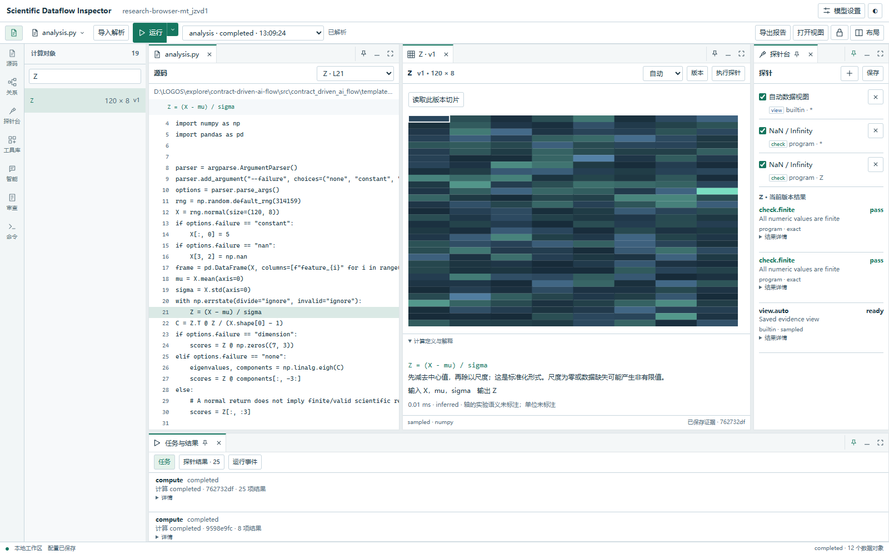

# Scientific Dataflow Inspector

**Live matrix inspection, computational provenance, and extensible probes for scientific code.**

Open existing analysis code. Observe real values. Follow transformations. Find numerical failures.

[简体中文](README.zh-CN.md) · [Quick start](docs/research/quickstart.md) · [CLI](docs/research/cli.md) · [Extensions](docs/research/adapter-api.md) · [Release evidence](docs/release.md)



A local research workbench for understanding what an experiment computed. Source lines, variable versions, matrix previews, transformations and probe results share one screen. Basic inspection and rule explanations work without a key. The observation protocol supports multiple data types; NumPy and pandas are the first built-in adapters.
## Workbench 0.4

Version **0.4** provides resizable document groups, minimize/maximize, pinned data versions, named and locked layouts. The **Computation Relations** graph highlights direct inputs and consumers with distinct provenance. Probes unify **view/check/interpret**, independent of builtin/program/model/Skill/manual execution. Real Matplotlib, Seaborn, Plotly and Altair adapters use saved evidence; imports and configuration never run the analysis. Explicit Run computes and renders; Replot reuses stored evidence.

The automatic task harness discovers the selected environment and registered tools, reads scoped evidence, records actual messages/tool calls and proposes bounded code changes for human review. Web, desktop and `cdaf research import/plan/run/probes/tools/ask/changes` use common services. See [workbench guide](docs/research/workbench.md) and [CLI](docs/research/cli.md).


## Try it locally

Python 3.11–3.13, from this checkout:

```console
python -m pip install ".[research,views]"
cdaf studio --project ./experiment
```

Choose an example or your own `.py` file and scientific interpreter, then **运行分析 / Run analysis**. Select `X`, `Z` or `C` to see definitions, dimensions, previews, expressions and upstream values. Run the example with `--failure nan` to inspect a normal return with failed numerical quality.

The package includes the compiled Web UI; ordinary use needs neither Node.js nor a key. Direct feature-branch installation needs no Git:

```console
python -m pip install "contract-driven-ai-flow[research,views] @ https://github.com/iyohesohoka646-dotcom/SFA/archive/refs/heads/feat/contract-driven-ai-flow.zip"
cdaf studio --project ./experiment
```

Closing the last tab stops its owned service after a three-second refresh grace period. Use `cdaf serve --project PATH` for persistent operation. Windows desktop builds wrap this interface with private Python; closing the window stops its owned backend. [Local deployment](docs/local-deployment.md) · [Desktop build](desktop/README.md).

## Web, desktop and CLI

| Entry | Use |
| --- | --- |
| `cdaf studio --project PATH` | Source, data, local flow, probes and timeline |
| Windows desktop | Same workbench, single instance, close cleanup and Open Terminal |
| `cdaf terminal --project PATH` or bare `cdaf` in a TTY | `/open /run /vars /probe /model /explain /help` |
| `cdaf observe analysis.py --python PATH --project PATH` | Batch observation in a separate scientific environment |
| `cdaf --json research runs --project PATH` | Saved evidence for automation; no rerun |

The agent uses the standard library as its base; the selected interpreter supplies scientific libraries. Independent CLI analyses can continue after a viewer closes.

**Model settings are in the top bar.** Offline rules are default. OpenAI-compatible and Anthropic profiles share project configuration with `/model` and `cdaf models`. Connection and inference tests differ. Keys use explicit environment or OS-vault references. Preview sending scope before requesting an explanation; samples are opt-in. Model output is unverified interpretation.

## Inspection and extensibility

Arrays, scalars and tables cover complex/high-dimensional/empty values, missing data and duplicate indices. Observations retain source digests, immutable versions, declared axes/units and fidelity. Canvas previews, historical slices, virtualized lists and sanitized offline reports show saved evidence. Execution and quality differ: `completed` can coexist with a failed probe.

Preview is bounded to 32×32 cells, saved-data slices to 64×64. Full capture is opt-in, normally limited to 64 MiB per artifact and 256 MiB per run. Missing historical data stays unavailable.

| Extension | Responsibility |
| --- | --- |
| `cdaf.research.adapters` | Capture another native type with declared capabilities |
| `cdaf.research.probes` | Read-only checks in separate processes with explicit budgets |
| `cdaf.research.runners` | Produce the same events from another execution backend |
| Frontend renderer registry | Present a descriptor/sample through a custom view |

Plugins are explicitly enabled. The [point-cloud adapter](examples/research/custom-adapter.py) and [renderer](web/src/research/PointCloudView.tsx) demonstrate an independent type without core registry edits. [Protocols](docs/research/adapter-api.md) · [Probes](docs/research/probe-api.md). GPU, sparse, lazy, distributed and non-Python backends have extension boundaries but no built-in support in this candidate.

## Evidence and compatibility

[Performance](docs/research/performance.md) covers 1,000 logical variables / 80 visible nodes / 10,000 events and two ten-minute 10 Hz matrix runs. Metadata-only indexes reduced the final two-minute browser heap median from 59.08 to 13.57 MiB on this host. This is no universal overhead guarantee or production certification.

Instrumentation has [explicit limits](docs/research/instrumentation.md); observed, inferred and declared relations are distinct. Code and plugins retain user file/network permissions. [Limitations](docs/research/limitations.md).

Scientific Dataflow Inspector is the working display name. Package `contract-driven-ai-flow`, import `contract_driven_ai_flow`, command `cdaf` and repository `SFA` stay compatible. This is a **0.4.0 local candidate**; no remote rename or PyPI publication. `sfa` remains an alias. Contract workflows remain in **旧版架构 / Legacy architecture** and [their reference](docs/workflow.md). [Migration](docs/research/migration.md) preserves originals and IDs without inventing scientific evidence.

## Development

Archify informs diagrams, Hamilton Python dataflow, and Codex/Kilo/DeepSeek Harness event-driven clients and lifecycle. [Architecture](docs/architecture.md) · [Design](docs/superpowers/specs/2026-10-01-scientific-dataflow-refactor-design.md) · [Contributing](CONTRIBUTING.md) · [Notices](NOTICE.md).

MIT. Based on original SFA. [Draft PR #1](https://github.com/iyohesohoka646-dotcom/SFA/pull/1).
