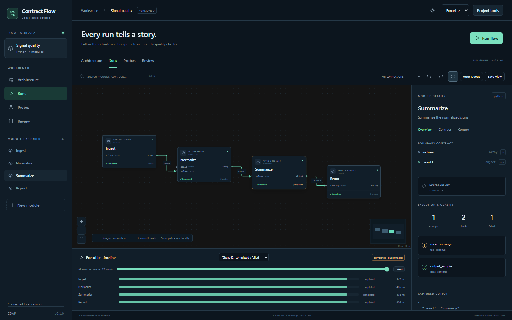

# Contract-Driven AI Flow

本地工作台已发布到[草稿 PR #1](https://github.com/iyohesohoka646-dotcom/SFA/pull/1) 的功能分支。使用 Python 3.11+ 和 Git 安装后即可打开内置 Web UI，并创建桌面快捷方式：

```console
python -m pip install "git+https://github.com/iyohesohoka646-dotcom/SFA.git@feat/contract-driven-ai-flow"
python -m contract_driven_ai_flow studio
python -m contract_driven_ai_flow shortcut
```

**Visual Flow-Based Programming for AI-Assisted Development**
契约驱动的 AI 可视化数据流编程。

定义代码结构，审查契约，生成模块，查看真实执行。人定义模块边界和数据依赖，AI 在明确范围内提交实现提案；架构、契约、源码差异和运行证据汇集到同一工作台。

[English](README.md) · [操作指南](docs/workflow.md) · [命令参考](docs/cli.md) · [架构与接口](docs/architecture.md)



[离线案例库](docs/examples/index.html)包含数据处理、外部调用业务流程、嵌套复合模块三个完整案例，每个案例都有真实成功运行和质量失败运行。下载或在本地打开 HTML 即可查看，它包含脱敏事件和图模型。GitHub 可直接预览[数据处理图](docs/examples/data-pipeline/architecture.svg)、[业务流程图](docs/examples/business-flow/architecture.svg)和[复合模块图](docs/examples/nested-composite/architecture.svg)。

## 解决什么问题

模块接口和输入绑定显式保存，编译阶段阻断重复写入、未绑定端口、环和非法跨边界连接。代码生成仅提出变更，接受前检查签名、装饰器、顶层结构及内部 import，并用 LibCST 保留周边源码；审查期间源码变化会使提案失效。架构提案和实现提案分别审查，移动节点只修改视图数据。

运行器以独立 Python 进程执行模块，通过 JSON 传递数据，避免上下游共享可修改对象。图上的状态来自实际事件；执行状态、质量检查和观察器故障分别记录。探针只读，阻断、暂停和恢复由独立控制策略处理。

## 无密钥快速体验

Windows 用户可以直接双击项目根目录的 **[启动工作台.cmd](启动工作台.cmd)**，它会准备环境并打开独立的本地 Web UI。首页提供项目列表、内置可运行案例、新建模板和已有目录入口；双击 **[停止工作台.cmd](停止工作台.cmd)** 可停止工作区服务。具体说明见[本地部署](docs/local-deployment.md)。

需要 Python 3.11+。在当前仓库或解压后的源代码发行包中，激活项目虚拟环境后执行：

```console
python -m pip install .
cdaf studio
```

可以从空目录启动。服务在后台运行，确认网页和认证接口就绪后打开浏览器；关闭终端或浏览器后继续运行，再次启动会复用服务。在已有项目目录运行时打开当前项目，使用 `cdaf studio --workspace` 可进入全部项目。默认自动选择空闲端口，`--port` 可以指定端口；`cdaf studio --stop` 正常停止对应服务。

安装后执行 `cdaf shortcut` 可创建原生桌面启动、停止快捷方式，`cdaf-studio` 提供无终端窗口的应用入口，`cdaf doctor` 检查安装。普通使用不需要 Node.js、API 密钥或云账户；Node.js 用于前端开发及可选 Archify 渲染。

执行 `cdaf demo --target cdaf-demo --serve` 可以运行自检示例：使用内置真实 Python 实现，验证一次 `completed / passed` 和一次 `completed / failed`，生成离线 HTML。目标目录必须为空。

`cdaf demo --example business-flow --target business-demo` 使用本地 HTTP 服务模拟外部库存接口，并执行实际 Decision 分支。`--example nested-composite` 展示两层公开端口映射。

当前交付是本地 **0.2.0 候选发行版**。远程仓库仍位于 [SFA](https://github.com/iyohesohoka646-dotcom/SFA)，发行包为 `contract-driven-ai-flow`，导入名为 `contract_driven_ai_flow`，主命令为 `cdaf`。PyPI 发布和远程更名是独立的发行操作。[发行与验收记录](docs/release.md)分别说明本机已验证能力和待跨平台验证项目。

## 完整修改与调试流程

1. 在 **Architecture** 选择 `Summarize`，编辑契约或显式输入绑定。点击 **Validate** 查看诊断，再用 **Review & save** 创建架构提案。
2. 在 **Review** 查看差异和诊断后接受。新建 Python 模块会得到骨架，仍需提交实现才能运行。
3. 在模块 **Context** 中提交候选函数，或执行 `cdaf generate ingest --project cdaf-demo`。生成操作创建提案，接受操作单独执行。
4. 在 **Runs** 选择成功样例并运行。节点和数据传递显示实际记录；失败样例展示模块正常返回、质量检查失败的情况。
5. 在 **Probes** 用样例预演 `$output.mean <= 5` 等严格布尔规则，选择继续、阻断、暂停或断点，再审查对应架构变更。点击节点查看摘要、错误及版本，按需导出脱敏证据。

离线生成器按契约中的输入输出样例生成可执行候选，只支持这些样例，超出范围会明确报错。它用于体验生成与审查闭环；内置 demo 则执行普通 Python 实现。可选 OpenAI、Anthropic 适配器使用明确的模型和环境变量密钥，当前离线验收未调用付费服务。

## 核心概念

工作台保留 Architecture、Runs、Probes、Review 四个视图；Project tools 提供执行计划、源码扫描、架构提案导入、集成导出、迁移、存储维护、安装诊断和命令目录。探针可编辑、禁用、删除，并通过架构审查生效。网页与 CLI 的对应关系、参考项目和验收范围见[功能对齐记录](docs/web-cli-delivery.md)。CLI 在终端中提供可读输出，管道中输出 JSON；`cdaf --json …`、`--human` 可明确选择格式，`cdaf run --input -` 接收标准输入中的 JSON。

| 概念 | 实际行为 |
|---|---|
| 统一模型 | `ProjectSpec → ExecutionPlan → RunEvent` 为 CLI、HTTP 和网页提供相同语义。 |
| 模块与契约 | 文件路径、完整符号名、源码摘要定位 Python 入口；复合模块和确定性 Decision 也有契约。 |
| 输入绑定 | 明确来自项目输入、上游 JSON Pointer 或字面默认值；多源写入需显式合并模块。 |
| 复合模块 | 公开端口映射到内部子图，展开前核对公开契约，运行时验证完整输入输出对象。 |
| 探针与控制 | 观察结果为 `pass / fail / error / skipped`；调度策略独立决定后续行为。 |
| L1–L4 上下文 | 逐步包含契约、样例、身份、获准符号源码；请求级别受连线可见性上限约束。 |
| 变更提案 | 绑定基础版本，审查后应用；代码回滚通过新的逆向提案完成。 |
| 证据与视图 | `.cdaf/` 保存事件与有界产物，`flow/views.json` 保存独立的布局和主题。 |

## 能力与限制

工作台支持四种共享画布视图、输入绑定表单、契约与复合端口 JSON 编辑、撤销重做、搜索、静态路径聚焦、分组展开、键盘操作、明暗主题和低动效模式。历史回放读取当时的模型和事件，不会自动重复外部副作用。HTML、SVG、PNG、Mermaid、JSON 可以离线导出；可选适配器提供 OTLP/JSON 和固定版本 Archify 设计图。

首版执行本地 Python 有向无环图，默认串行，支持有界并发、超时、取消及显式幂等重试。契约兼容性返回兼容、不兼容、无法判断；无法证明时须细化契约或明确声明动态边界，实际数据仍接受运行验证。子进程继承当前用户的文件和网络权限，进程隔离不提供操作系统沙箱。采集默认脱敏摘要，完整采集需显式开启并受到大小与保留期限制，具体说明见[执行与证据](docs/architecture.md#execution-and-evidence)。

已有代码扫描仅提出候选，不会将推断依赖直接变为执行连线。实例方法自动构造、循环执行、多语言、多人实时协作和分布式调度尚未实现。探针使用有预算限制的版本 1 表达式语言，借鉴 CEL 的思路，没有宣称兼容 CEL。

## 借鉴与文档

[Archify](https://github.com/tt-a1i/archify)提供版本化图模型与校验产物的参考，[LikeC4](https://github.com/likec4/likec4)提供同一模型的多视图模式，[Hamilton](https://github.com/apache/hamilton)与 [NoFlo](https://github.com/noflo/noflo)提供函数数据流和公开端口模式。[研究与比较](docs/research.md)说明各项目的实际重叠和本项目取舍。LangGraph 的条件边可以由普通确定性函数定义，本项目的定位来自契约、受限实现变更和运行证据。

[操作指南](docs/workflow.md) · [命令参考](docs/cli.md) · [架构](docs/architecture.md) · [迁移](docs/migration.md) · [案例](docs/examples/index.html) · [发行验收](docs/release.md) · [贡献](CONTRIBUTING.md)

`sfa` 作为新命令兼容别名保留一个主要版本。旧命令用 `sfa legacy …` 或 `python -m sfa …` 进入；迁移提供预览和独立目标目录备份，遇到多上游歧义会要求明确绑定。`clean` 默认只清缓存，保留架构定义。

MIT；保留原始 SFA 的版权与来源，[第三方说明](NOTICE.md)列出发行资源的许可证。
