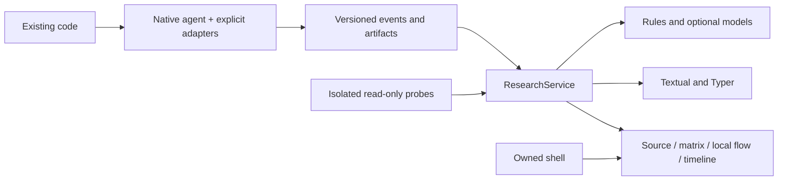
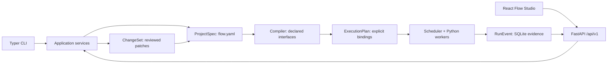

# Architecture and API

Scientific Dataflow Inspector shares ResearchService, ModelSettingsService and asynchronous command dispatch across Web, desktop, terminal and batch clients. A standard-library agent runs in the selected scientific interpreter; bounded captures flow into SQLite and referenced artifacts. The desktop shell adds process ownership rather than another computation model.

Descriptor kinds and capabilities are extensible strings. AdapterRegistry, ProbeRegistry and RunnerRegistry use explicit version-1 registration; the frontend selects renderers by descriptors. Unknown types remain safe metadata. Numeric updates change indexes and detail rather than graph topology. Historical indexes retain metadata only; samples are read on demand. Observed, inferred and declared paths are distinct.

`research.yaml` saves authored settings; `.cdaf/research/` saves evidence. Model profiles store credential references. Session/origin validation, resumable events and actual asynchronous cancellation apply to local APIs. Browser leases use real connections; desktop cleanup retains owned process handles. Independent CLI analyses retain their own ownership. See [extensions](research/adapter-api.md), [probes](research/probe-api.md), [lifecycle](local-deployment.md) and [limits](research/limitations.md).

## Retained contract architecture

The application is a modular monolith. Python owns semantics and execution; Typer and FastAPI adapt the same compiler, changes, context, runtime and storage services. React/TypeScript/React Flow displays and edits that model. ELK runs through its dedicated Web Worker protocol; Python wheels contain the built frontend.

## Semantic model

`ModuleSpec` identifies a Python entry by relative path, complete qualified name and optional symbol digest; composites declare public object ports and child mappings; Decision modules evaluate a deterministic Boolean expression. `PortBinding` maps one target input to a project value, upstream output or literal using RFC 6901 pointers. Empty pointers select the entire value, including scalars and null. Declaration order cannot overwrite an input. Introduce an explicit merge module for fan-in.

The compiler validates schemas, references, duplicate IDs/writers, required bindings, cycles, parents, visibility and probe syntax. It checks the **declared** composite interfaces before flattening, produces executable bindings, and preserves hierarchy and public boundary maps. Readiness includes all public fields needed for whole-object checks. Runtime validation checks both the public object and the child contracts.

Schema compatibility is a conservative subset proof: `compatible`, `incompatible`, or `unknown`. Equal schemas, primitive widening, required object fields, array items, enums/constants and selected unions are supported. Unsupported constraints remain unknown; an explicit `dynamic: true` admits unknown bindings with a warning and retains actual-data checks. Incompatible bindings always block. The compiler does not claim a complete JSON Schema theorem prover.

Contracts and probes are part of the semantic revision. Layout, collapsed groups and theme use a separate view revision, so dragging a node cannot invalidate implementation review. Generated JSON Schema is the frontend type source. Schema version 1 is required; unfamiliar versions and fields are rejected.

## Reviewed changes and AI context

The sequence is context → candidate → static validation → diff → explicit acceptance. A ChangeSet is inert, records its base project revision and full source digest, and is revalidated during acceptance. AST checks preserve parameters, annotations, async status and decorators; reject extra top-level definitions/statements and disallowed imports anywhere in the candidate; LibCST replaces only the selected body. Syntax errors block proposals. Import checks constrain accepted patches and do not sandbox the original code or external tools.

Rollback produces an inverse proposal from the old function body, against the current file. It refuses to overwrite a target changed since acceptance and preserves unrelated edits in the same file. Architecture rollback is a new architecture proposal. Accepted architecture can scaffold missing top-level functions; the skeleton explicitly remains unimplemented until a code proposal is accepted.

L1 gives upstream schemas/descriptions; L2 adds sanitized contract fixtures; L3 adds symbol identity and explicitly authorized dependencies; L4 adds authorized upstream symbols. The effective upstream level is the minimum of the request and its bindings' visibility caps. A symbol shared by several bindings takes their most restrictive cap. Same-file neighbors are excluded. Target code is included at all levels. Context reports byte count, token estimate, bindings and actual effective levels. Runtime samples become fixtures only through a reviewed promotion; historical captures are never silently sent to a provider.

OpenAI/Anthropic adapters are optional. They use explicit model configuration, SDK timeouts, bounded retries, environment credentials and usage records. The default mock creates fixture-specific executable candidates. Architecture proposals can be submitted as JSON by a person or external AI agent. Filesystem permissions for an external agent are configured independently of CDAF's accepted-patch checker.

## Execution and evidence

The default scheduler is serial; `concurrency` permits 1–16 independent module attempts. Each Python attempt uses a spawned child process. Inputs/outputs cross a strict JSON boundary, limited to 16 MiB. Nested objects do not share references. Sync and async functions and named ports for positional-only parameters are supported. A Decision chooses a real guarded branch; unselected modules receive explicit skipped events. A BranchObserver records a condition and hypothetical target without controlling routing.

Retries default to zero and require `idempotent: true`. Each attempt records contract version, links to upstream transfer evidence, duration and completion/failure/timeout/cancellation. A declared symbol digest is verified before dispatch; the worker checks the whole-file digest captured for that run before loading. File entries use a private project package namespace, supporting existing relative imports and parent re-exports while the entry loader executes the verified bytes. Imported helper files retain ordinary Python loading behavior. Import failures, process exits and encoding errors produce a final run record. Execution, quality and observability are separate: a completed module can fail an assertion; an observer error degrades observability; an unavailable blocking check pauses until explicit resume/cancel. A pause stops new dispatch; work already executing reaches its next module boundary. One resume releases the waiting boundaries, without preauthorizing future breakpoints. Composite guards apply to every descendant. Replay reads evidence; a new run is explicit and never silently repeats side effects.

Probes are read-only. Assertions require an actual Boolean, and return pass/fail/error/skipped. Metrics and captures are bounded; edge probes identify the relevant incoming binding. Control policies are continue, block, pause and breakpoint. Version-1 expressions are compiled and cached, with length, AST depth/node count, gas and numeric limits. Powers, string expansion, arbitrary calls, comprehensions, dunder access and Python eval are unavailable. Missing data and evaluation failures cannot pass a rule.

Processes inherit the current user's filesystem and network permissions. They are not an OS security sandbox, container, memory quota, or network allowlist. Termination controls the owned worker; subprocesses deliberately created by user code are outside that guarantee. Review/run only project code you intend to execute. Dependencies and source versions recorded in a run describe available evidence, and do not reproduce an arbitrary external service.

Capture levels are metadata, summary, sample and full; summary is default. Sanitization runs before persistence, browser delivery, exports and AI context. Capture and metric probes sanitize the boundary before selecting a JSON Pointer, retaining redacted-path metadata. Sensitive field names are configurable, and narrative errors omit user exception strings/stdout/stderr. Sensitive literals, fixtures and data-bearing schema annotations are hidden in public plans and proposals; compilation always uses the original definition and returns its real revision. CLI and HTTP review share a representation that omits complete before/after source files. Byte limits, truncation, drop counts and redacted paths are recorded. These are explicit field/text rules, not a universal secret detector. Full capture requires an authored opt-in and applies the same bounds and retention period.

Authored definitions, source, reviewed raw changes and recovery intents remain as authored; they must preserve exact content to apply/undo code. Their lifecycle differs from sanitized execution evidence. Browser diffs omit entire source files and redact sensitive values. Do not put credentials in definitions; provider credentials belong in the process environment.

## Storage and recovery

| Location | Meaning |
|---|---|
| `flow.yaml` | Canonical executable architecture and contracts |
| `flow/contracts/<id>.<digest>.json` | Immutable contract revisions |
| `flow/views.json` | Position, hierarchy collapse and theme |
| `flow/changes/*.json` | Reviewable proposals and acceptance history |
| `.cdaf/runs.sqlite3` | Runs, versioned graph snapshots, ordered events, controls |
| `.cdaf/artifacts/<digest>.json` | Bounded sanitized artifacts / migrated evidence |
| `.cdaf/cache/` | Disposable cache |
| `.cdaf/transaction.json` | Durable multi-file write intent, removed on recovery |

Definitions belong in Git; `.cdaf/` is ignored. Writes use revision checks, staging, fsync, atomic replace and a roll-forward recovery journal under a SQLite write lock. Interrupted writes recover idempotently; external edits conflicting with a journal are reported for review. SQLite connections close after each transaction. Dead run owners are marked interrupted on restart. Windows process liveness uses process handles, not `os.kill(pid, 0)`.

`clean` removes cache by default. An explicit ISO cutoff prunes completed run evidence; it never removes architecture or review history. Automatic evidence retention uses the project's configured days. Legacy backups remain separately retained and may contain original unsanitized history.

## Local HTTP API

Studio binds `127.0.0.1`; API requests require `Authorization: Bearer <session>`, and loopback Host/Origin checks reject other browser origins. The opening URL carries a session fragment which the client moves to session storage and removes from the address. Request bodies are bounded to 2 MiB; content/security headers and no-store caching apply. The session URL is a credential for this local project.

| Endpoint | Operation |
|---|---|
| `GET /api/v1/project`, `/schema`, `/plan` | Read current sanitized semantics, schema and plan |
| `POST /api/v1/check` | Compile a draft without applying it |
| `PUT /api/v1/view` | Save view with its independent base revision |
| `GET /api/v1/candidates`, `/context/{module}?level=L2` | Read code candidates or actual AI context |
| `POST /api/v1/changes/architecture`, `/implementation` | Create an inert proposal |
| `POST /api/v1/changes/{id}/accept`, `/reject`, `/rollback` | Review or propose inverse change |
| `POST /api/v1/generate`, `/probes/preview` | Create a code candidate or evaluate a rule |
| `GET/POST /api/v1/runs` | List or explicitly start a run |
| `GET /api/v1/runs/{id}`, `POST .../{pause,resume,cancel}` | Read evidence or control an owned run |
| `GET /api/v1/runs/{id}/events?stream=true` | SSE, resumable by sequence / Last-Event-ID |
| `GET /api/v1/export/{html,svg,png,mermaid,json}` | `current=true` exports the current reviewed architecture; `run_id=ID` selects historical evidence |

Mutations carry `base_revision`; stale edits return 409 and require a refreshed proposal. Redacted editor values are restored from the matching authored version before validation, so saving a title cannot overwrite a hidden credential with its mask. HTTP/CLI actions call the same services; there is no separate browser execution engine.

## Exports and adapters

Standalone HTML embeds sanitized JSON, SVG and its controls. It has no remote runtime dependency. SVG, PNG, Mermaid and JSON use the same historical dataset, plus separate geometric receipts. Receipt checks do not replace browser checks for glyphs, controls and accessibility. The current gallery supplies both evidence and reproducible source models.

Studio exports the current reviewed architecture from Architecture, Probes and Review, and the selected historic graph from Runs. Unreviewed drafts must be accepted before an architecture export represents them. CLI `export --current` explicitly selects the current architecture; without `--current` or `--run`, it selects the most recent recorded run if one exists.

`cdaf export --format otel` writes OTLP/JSON. Each attempt is a span, fan-in is represented by links, and probes/control events preserve their sequence/timestamps. Optional `export_otel()` accepts a caller-configured OpenTelemetry SpanExporter; it never installs a global provider or sends data by default. [OTLP encoding](https://opentelemetry.io/docs/specs/otlp/#otlpjson-protobuf-encoding) and [span links](https://opentelemetry.io/docs/specs/otel/trace/api/#specifying-links) define the external format.

Archify is an optional design-view adapter pinned to `a07fa1d5b2a10cbea110c5a2be2817397a301cdc`. The adapter verifies a clean checkout at that commit, validates typed IR, renders and checks HTML, then atomically writes output plus a reference receipt. Python-only exports do not depend on Archify or Node.js. Design relationships remain static reachability, even if the exported graph came from a recorded revision.
