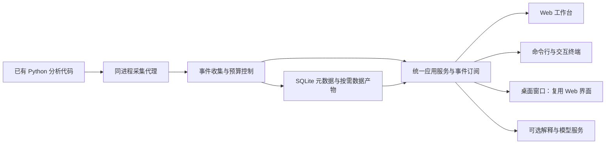

# SFA 科研数据流重构设计

日期：2026-10-01。状态：设计已实施，0.3.0 Windows 本地候选版已完成实际安装及窗口关闭验收，Python 核心跨平台 CI 已通过；实际范围与未验证边界以发行记录为准。

## 1. 新定位与成功标准

建议产品展示名为 **Scientific Dataflow Inspector**，中文为“科研数据流观察器”，副标题为 **Live matrix inspection, computational provenance, and extensible probes for scientific Python**。这是待审查的工作名称；本轮不更改 GitHub 仓库名、发行包名或既有命令。后续名称发布前再核查发行包和命令命名空间。

首版首先验证已有的 NumPy／pandas 实验和分析代码，核心协议同时支持其他数据与计算框架的适配器。研究者应能够回答：一个变量在哪里定义、各个维度是什么、当前值如何分布、哪次运算产生了它、后续哪些结果使用了它，以及异常最早从哪里出现。矩阵、运算、数据版本和探针是新的领域模型。原有契约与架构编辑退为可选的高级能力。

首个完整案例为“读取表格 → 缺失值处理 → 按列标准化 → 协方差 → PCA 投影”。成功运行与故障运行使用同一份源代码和可复现的合成输入，故障包括常量列造成除零、缺失值传播和维度不匹配。最小交付必须允许用户接入自己的普通 `.py` 文件，不能只展示内置案例。

“即时”指程序运行时持续发布有界观察事件，界面及时显示已经产生的数据。首版不承诺自动重算任意脚本；编辑代码、查看历史或展开矩阵都不会隐式执行代码。用户明确启动新运行后才重新计算。

## 2. 三种路线与选择

| 路线 | 收益 | 成本与限制 | 选择 |
| --- | --- | --- | --- |
| 观察已有脚本，生成数据与运算记录 | 保留研究者的 NumPy／pandas 代码、环境和计算顺序 | 自动溯源有覆盖边界，需要明确报告 | 主路线 |
| 继续要求先画图、写端口契约、再执行 | 执行关系可预先检查 | 接入旧实验代码需要大量改写，矩阵定义难以自然呈现 | 旧项目兼容与高级模式 |
| 重建一套响应式 Notebook | 代码、输出、交互关联直接 | 新编辑器与内核维护范围过大，改变现有工作方式 | 后续通过适配器接入 Jupyter／marimo |

第一版采用低开销的显式观察 SDK，同时提供对选定用户源码的自动插桩。自动插桩不作为万能追踪器：覆盖不足的代码显示未观察或关系未知，不能制造完整数据流的印象。

## 3. 应用与技术边界

采用一个本地应用服务、一个事件与数据协议、三种客户端：



- 保留 Python 作为科研对象采集与计算环境接入层，保留 FastAPI 与 SQLite 的适用部分。现阶段没有证据表明把后端全换成另一种语言能解决已观察到的前端刷新和布局成本。
- 前端继续使用 TypeScript／React。React Flow 只承担局部运算关系图；矩阵与表格不使用成千上万个 DOM 节点绘制。
- 桌面客户端建议采用 Tauri 2 作为轻量窗口和进程生命周期外壳，复用同一套 Web 资源。打包前必须验证 Windows WebView2、Python 环境发现、安装与关闭行为；不能把开发启动当成桌面发行完成。
- 命令行保留 Typer 批处理入口，交互终端采用 Textual。参考 Kilo／Codex 的事件驱动交互、命令发现、模型选择和可取消任务，不复制其完整编码代理，也不要求为相似外观重写全部核心为 Rust 或 Bun。
- UI 服务与用户科研 Python 环境分开。采集代理使用标准库作为基础，仅在对应适配器中读取已安装的 NumPy／pandas；不得要求用户计算环境安装 FastAPI、React 或终端 UI。运行清单记录实际解释器路径与依赖版本。
- 首版仍为本地部署。“统一服务化”落实为 SDK、CLI、Web、桌面共用应用服务；公网多租户 SaaS、账户和计费不进入本轮范围。

## 4. 新语义模型

| 类型 | 责任 |
| --- | --- |
| `ExperimentSpec` | 源码入口、解释器、用户数据注释、探针和采集预算 |
| `SourceRef` | 文件、限定符号、行区间和源码摘要 |
| `ValueDescriptor` | 任意已注册后端的数据类型、形状、dtype、设备、能力及用户声明的轴／单位 |
| `SnapshotRef` | 一次观察时刻的逻辑值、变量绑定、版本、样例或物化产物引用 |
| `OperationRecord` | 来源代码、输入与输出快照、执行次数、状态和已测量的耗时 |
| `ObservationEvent` | 运行 ID、递增序号、源码版本、操作、快照和事件时间 |
| `ProbeSpec` / `ProbeResult` | 探针配置、输入范围、计算成本、结果与证据完备性 |
| `Explanation` | 关联源码与事件的解释，标注规则推导、用户注释或模型生成 |

变量名与值必须分开：同名局部变量属于不同作用域；一次重新赋值产生新绑定版本。循环按实际观察的迭代记录版本，不要求用户脚本预先满足无环拓扑。

别名和原地修改需要特别处理。可观察到的赋值与原地写入产生新的观察版本，NumPy 视图与共享存储标记已确认或可能共享。任意动态调用中的隐蔽修改无法在低开销模式保证捕获，需显示覆盖边界并允许显式 `watch`。历史快照不得通过活对象引用悄悄变成新值。

轴含义、物理单位和实验分组优先来自用户注释、表格列名或明确声明。系统可确认 `shape=(1200, 64)`，却不能仅凭形状断定“受试者 × 脑区”。没有依据的语义保持未命名。

## 5. 科研对象和采集方式

### 5.1 首版对象

适配器通过 `cdaf.research.adapters` 注册协议 `version=1`，具有 `supports(value)`、`describe(value)`、`capture(value, policy)` 与可选 `read_region`。描述符保存后端／设备、数据种类和 `preview/slice/statistics/materialize/alias` 能力；类型 ID 为可扩展字符串，不能写死为两种框架的枚举。未知对象只提供安全的类型元数据，不调用属性、`repr` 或强制转换。

第三方适配器需显式启用，避免扫描已安装包时执行任意插件代码；界面按能力而非框架名称选视图。提供真实的第三方示例适配器及兼容性测试，验证不修改核心即可接入新类型。GPU、稀疏、分块和延迟计算对象默认只读元数据，复制、致密化、传输设备和触发计算均须声明成本并明确开启。运行器与可视化渲染器也预留版本化接口，后续非 Python 执行器通过同一事件协议接入。

支持 NumPy 数值 ndarray／标量与 pandas Series／DataFrame。至少覆盖零维、一维、二维、高维、空数组、复数、非连续视图、缺失值、分类列、时间列和重复索引。字符串及 object 列采用有界、脱敏的类型化预览，不调用任意用户对象的 `repr`，不使用 pickle。

保留用户代码中的原生对象。观察器不会为了传输而把整个 ndarray 转成 JSON 列表，也不会把函数输入输出替换成远程数据引用。JSON 用于元数据和小样例；明确保存的数值数组采用 `.npy` 且禁止 pickle，表格完整产物采用可选 Arrow IPC。

### 5.2 两种接入

1. **显式 SDK**：`TraceSession.watch(name, value, axes=..., unit=..., parents=...)` 观察已定义的数据；`TraceSession.operation(label, inputs=...)` 记录用户指定的运算范围。适合低开销观察、动态代码、复杂函数及准确的人工语义注释。
2. **自动插桩**：分析允许列表内的用户 `.py` 文件，在内存中对选定赋值、调用边界及常见原地写入插入采集点。保持原文件、执行次数、求值顺序和 traceback 行映射；首版支持普通赋值、解包、分支、循环和函数作用域。`eval`／`exec`、动态生成代码、未覆盖的原生调用、多进程子任务都显示覆盖诊断。

自动模式不能未经验证就全局 monkey-patch NumPy，不能在每条 Python 语句后扫描整个进程的所有变量。依赖关系区分“实际观察”“源码推断”和“用户声明”；表达式里出现某个名字不等于已经证明其逐元素数据依赖。

### 5.3 默认预算

- 默认模式为 `summary`；另有 `metadata`、`sample` 和显式 `full`。
- 默认矩阵预览最多 32×32 个单元，统计采样最多 4096 个元素；显示采样方法、实际样本数及是否精确。
- 默认发布间隔 100 毫秒，同一变量的高频普通更新可合并。异常、探针失败、覆盖丢失和运行结束事件不得静默丢弃。
- 收集队列上限 2048 条；普通事件拥塞时合并或丢弃并记录计数。终止及错误使用独立保留通道，避免分析被可视化拖住。
- 数值切片单次响应最多 64×64 个单元；只允许读取已保存的对应快照，或明确标为当前活对象的数据。没有保存的历史完整值应返回不可用，不能用最新值冒充。
- 完整采集默认关闭。显式开启后单产物上限 64 MiB、单运行上限 256 MiB，先检查大小再复制；超出预算保留描述符、记录截断原因。
- 默认完整产物保留 7 天，清理保留源码、注释、探针定义和元数据；运行期间的产物不得被清理。

## 6. 矩阵与代码界面

工作台重写为四个协调区域：源码与运算列表、当前变量／矩阵、局部数据流、探针与时间线。首页提供“打开分析代码”“选择 Python 环境”“运行／连接”“模型设置”，不要求先创建模块与端口。

矩阵视图显示定义位置、维度、dtype、轴注释、单位、有限值／缺失值摘要、热图和有界数值切片。高维数组通过固定轴与切片选择查看二维平面；复数允许选择实部、虚部或幅值。DataFrame 使用虚拟化表格，列类型和索引信息持续可见。

运算视图让输入、表达式、输出一起出现。例如：

```text
X: (1200, 64) → mu = X.mean(axis=0): (64,)
Z = (X - mu) / sigma: (1200, 64)
C = Z.T @ Z / 1199: (64, 64)
scores = Z @ components[:, :8]: (1200, 8)
```

没有轴注释时解释为“沿 axis=0 计算均值”；有明确样本／特征注释后才解释为“对每个特征计算样本均值”。广播、转置、切片、reshape、聚合、矩阵乘法和标准化使用可核对的规则模板。复杂用户函数展示实际输入输出与源码，无法确认的语义标记未知。

默认只画当前选择的直接上游和下游，初始最多 80 个可见节点；全局概览聚合为函数或用户分组，展开需要用户操作。节点位置与数据快照分开管理；数值更新不触发 ELK 布局。热图以 Canvas 绘制，表格和历史列表虚拟化，长时间线按游标分页。

## 7. 可扩展探针

探针通过版本化注册协议接收描述符、有界样例与明确授权的产物引用，返回结构化结果。第三方探针在独立工作进程运行，默认不能拿到原分析进程里的可变对象。探针故障与分析代码故障分开记录。

首批探针：形状／维度兼容、dtype、NaN／Inf、范围、缺失比例、均值／方差变化、对称性、耗时、采集大小。秩、条件数、特征值、分布检验属于显式启用的昂贵探针，必须显示数据范围和预算。抽样检查通过只能表示样本通过，不能宣称全矩阵通过。

结果统一为 `pass / fail / error / skipped / unknown`。每项结果另外说明 `exact / sampled / metadata_only`。探针是只读观察；暂停和取消由单独的控制策略执行。失败不得自动重写科研代码或重新运行具有副作用的步骤。

## 8. 解释与模型配置

离线规则解释先覆盖明确的矩阵运算，基础观察、热图和探针不依赖模型或 API Key。模型用于解释一段已选择的数据流、提议探针和解读已有诊断，输出必须关联源码区间与观察证据。

设置页与终端 `/model` 共享 `ProviderProfile`：协议、服务地址、模型 ID、默认用途、超时、凭据引用和连接状态。首版支持 OpenAI-compatible 协议（包括使用该协议的 DeepSeek／本地模型服务）及现有 Anthropic 适配器；提供模型列表、手动填写、连接测试和取消。

连接测试先请求模型列表或健康接口，标为“连通性检查”；用户明确发起生成测试时才提交模型推理请求，并提示可能产生费用。凭据由本地后端写入系统凭据库，配置文件只保存引用；浏览器读取接口不返回密钥，不保存到 localStorage，不进入事件、导出或 AI 上下文。没有可用系统凭据库时使用明确的环境变量引用，不静默写明文配置。

用户选择“解释当前步骤”后，先展示发送范围：源码、描述符、脱敏摘要和可选有界样例。原始全量科研数据默认不发送。模型回答区分计算事实、规则推导和模型推测；无法从运行证据支持的结论不能变成确定标签。

## 9. CLI、Web 与桌面生命周期

批处理 CLI 提供观察、运行列表、矩阵摘要、探针、导出、模型设置与诊断，支持 JSON 和有意义的退出码。直接运行 `cdaf` 在交互终端进入工作台，管道或非 TTY 场景输出帮助；`cdaf --help` 始终可用。保留旧入口至少一个主要版本，兼容行为须在迁移表中逐项说明。

交互终端具备项目／实验切换、实时事件、变量检索、摘要预览、取消与恢复历史。发现命令包括 `/open`、`/run`、`/vars`、`/probe`、`/model`、`/help`、`/quit`；快捷键和错误在界面内可见。网络／采集／模型任务均异步执行，不占用输入循环。

桌面入口只保留一个：打开窗口时启动或连接服务，窗口显示 `starting / ready / error / stopping`。默认关闭拥有服务的窗口时取消它拥有的运行、落盘并关闭子进程；用户显式选择后台服务后才持续运行。不能关闭通过独立 CLI 启动的另一项分析任务。

普通浏览器模式使用多标签客户端租约：最后一个标签正常退出后 3 秒停止其拥有的服务；刷新和路由切换不会关服。连接异常或浏览器崩溃通过 120 秒租约超时回收；后台标签不得仅因计时器节流被误判关闭。浏览器模式无法保证收到关闭通知，因此桌面窗口提供确定的关闭语义。界面中始终提供“退出并停止服务”，后台模式明确可见。

## 10. 性能与正确性验收

已有记录 `docs/assets/large-graph-performance.json`：630 个模块折叠为 30 个可见节点，加载与布局 8423 ms；展开 9872 ms；搜索交互 325 ms。4 节点案例的搜索为 41 ms。这些是现有版本的历史测试记录，不是本轮新跑的剖析。

源码可确认存在每次渲染序列化整个项目、逐节点遍历全部事件、模型变化重新布局和全局 `busy` 控件禁用。它们是需要验证的开销与交互风险，不能仅凭静态阅读认定已经解释了所有“按键点不动”。P0 必须实际复现并拆分 API、渲染、布局、任务状态和点击响应耗时。

新版本验收目标在同机、同解释器、同源码、固定输入下衡量，公开原始数据及硬件环境；下列数值是目标，不是已达到的结果：

| 场景 | 验收目标 |
| --- | --- |
| 普通分析与选定观察点 | 不改变输出、dtype、随机流、求值次数及原异常位置 |
| 服务已就绪后的科研首页 | ≤2 秒可交互，历史列表和矩阵详情不阻塞首屏 |
| 10 秒以上 NumPy 分析，显式 SDK 默认摘要 | 中位额外耗时 ≤5%，不强制复制全量矩阵 |
| 同案例自动插桩摘要模式 | 中位额外耗时 ≤20%，超标必须缩小覆盖或明确标为调试模式 |
| 1000 个逻辑值、80 个可见节点、10000 条历史事件 | 搜索／选中／切换 p95 首次视觉响应 ≤100 ms；完整局部详情 ≤250 ms |
| 稳态观察流 10 次更新／秒 | 发布至可见 p95 ≤250 ms；持续 10 分钟内存不随事件数无界增长 |
| 无模型、慢模型、失败模型 | 数据查看、探针和取消持续可用；对应操作呈现独立状态 |
| 生命周期 | 单入口启动；正常退出释放拥有的进程与端口；刷新、多标签、崩溃按第 9 节行为验证 |

昂贵数值检查与全量快照单独计时，不混进默认开销指标。至少进行一次人工使用验收：打开自己的分析脚本、观察矩阵、定位故障、设置探针、检查发送范围、关闭应用。测试数量、构建成功和端口连通均不能替代这项验收。

## 11. 旧项目迁移与目录边界

新核心位于 `src/contract_driven_ai_flow/research/`，独立于旧 `ProjectSpec` 的强制端口编译流程。科学采集代理位于同包的 `research/agent/`，不能导入 Web 服务或旧调度器。新应用服务位于 `application/`；旧定义通过 `research/legacy.py` 适配。

保留可验证的存储事务、脱敏、源码摘要、历史记录与代码审查机制。重写前端默认产品、CLI 工作流、采集链路与数据模型。旧 `flow.yaml`、探针和历史运行首先备份并只读转换；旧 Router 保持观察语义。旧运行缺少矩阵、轴或源码版本时标记“旧格式／未采集”，不补造数据。成功迁移并核对后，旧编辑器移出默认页面。

实验定义、注释、探针和视图可提交 Git；`.cdaf/` 保存运行记录、缓存和有界产物。删除缓存、卸载客户端或关闭窗口均不能删除用户分析代码和数据集。

## 12. 阶段划分

| 阶段 | 独立交付 | 进入下一阶段的条件 |
| --- | --- | --- |
| P0：核查与重构基线 | 真实交互剖析、旧能力清单、参考源码记录、精简科研案例与迁移样本 | 已复现响应问题；确认新主流程与数据语义 |
| P1：科研观察核心 | 原生 NumPy／pandas 适配、SDK、版本化快照、事件与预算、基础 CLI | 不改分析结果；可从已有脚本取得有界观察记录 |
| P2：自动接入与探针 | 选定源码插桩、作用域溯源、覆盖诊断、第三方探针协议 | 分支、循环、别名、原地修改和失败均有准确的证据范围 |
| P3：科研工作台 | 矩阵／表格、源码联动、局部数据流、回放、规则解释 | 真实成功与故障分析可通过网页完整完成；交互目标达标 |
| P4：统一产品入口 | 模型设置、交互 CLI、桌面外壳、浏览器租约与统一控制 | 三入口共用配置、事件和操作；关闭行为与凭据保护通过验收 |
| P5：迁移与发行 | 中英文定位、真实案例、离线报告、安装包与跨平台验证 | 干净环境安装及用户实际操作完成，记录限制与未支持对象 |

P1–P2 对应科研核心计划；P3–P5 对应统一工作台计划。每个子项目可独立验证和提交，工作台依赖核心协议稳定。首版不增加 GPU／PyTorch、MATLAB／R、分布式调度、实时多人协作或远程多租户。

## 13. 开源参考与实际借鉴范围

以下已读取相关官方文档或选定源文件，并未克隆、运行或完整审查全部参考项目：

- [marimo 数据流界面](https://docs.marimo.io/guides/editor_features/dataflow/)：变量来源／使用位置、局部依赖与全局图分开，适用于本项目的源码联动。
- [noWorkflow](https://github.com/gems-uff/noworkflow)：普通 Python 科研代码的运行溯源；参考其 AST 与运行采集思路，同时对本项目的覆盖和开销独立验证。
- [Datashader 管线](https://datashader.org/getting_started/Pipeline.html)：按显示分辨率组织聚合和渲染；借鉴预算思路，不能把抽样预览当作精确聚合结果。
- [Kilo 模型选择源码](https://github.com/Kilo-Org/kilocode/blob/dfb23a4e63e24e82a669a0eaf1e48e3c4ca21bec/packages/tui/src/component/dialog-model.tsx)：可搜索、最近使用、收藏、明确配置入口，以及避免对每个模型重复遍历列表。
- [Codex 终端应用源码](https://github.com/openai/codex/blob/6b4daafdb445340e5af66f067ad4057e6ed9fd81/codex-rs/tui/src/app.rs)：客户端状态、后台请求、事件通道和取消机制分工；实施时继续针对输入／渲染循环阅读子模块。
- [DeepSeek Harness 桌面后端控制](https://github.com/deepseek-ai/deepseek-harness/blob/639ed015397290b3745d163aafe02ffee4aa3f84/apps/desktop/src/backend-controller.ts)：启动尝试、停止、清理与错误状态分离，适用于单入口生命周期。
- [DeepSeek Harness 模型设置](https://github.com/deepseek-ai/deepseek-harness/blob/639ed015397290b3745d163aafe02ffee4aa3f84/packages/client/ui-settings-models/src/client/ProviderEditor.tsx)：独立且可发现的模型设置流程；不照搬其完整插件内核。
- Archify 已有研究记录继续用于可分享图、版本与导出，科研数据模型不依赖它。

参考源码固定为 Kilo `dfb23a4e63e24e82a669a0eaf1e48e3c4ca21bec`、Codex `6b4daafdb445340e5af66f067ad4057e6ed9fd81`、DeepSeek Harness `639ed015397290b3745d163aafe02ffee4aa3f84`。采用源码片段前核查相应许可证并保留必要声明；本计划以行为和架构借鉴为主。
