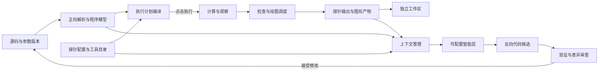

# 统一科研探针与独立工作区：设计评审稿

日期：2026-10-02。修订：2。状态：按用户反馈重做工作区交互，尚未实施。前稿的阶段式首页和固定说明面板已撤回。本稿替代旧方案中“渲染器只负责显示、探针只负责判断、解释另设入口”的产品划分。当前程序基线为 `96aaca6e9c6404480ef547970a8a6251b9db371c`；本稿不代表新功能已经运行或通过验收。

## 1. 用户要完成的任务

研究者打开实验或数据分析代码，先看完整结构，再给某个变量、运算或数据路径挂上多种探针，从数值、图像、规则和分析流程理解代码。矩阵视图、数据表与热图本身都是探针；检查程序、人工审读流程、Skill 和通过内部模型 API 完成的解析也都进入同一个探针体系。

工具库以公开可获取的生态为范围。本机与所选解释器用于判断可用性，不用于限定工具目录。AI 可以协助识别代码、解释数据、选择可视化方式、解析扩展说明；上下文必须可管理、可查看，并绑定实际源码和数据版本。

用户已经选择：**独立标签页＋可调整分屏**，并明确要求软件工具的布局与交互，拒绝线性向导、阶段式首页和面板下的长篇常驻解释。总体图可以独立放大、全屏和操作；多个探针可以并排固定。保留本地服务、Windows 桌面、Web、终端和批处理入口，共用设置和服务。

补充要求：先导入、解析与配置，再通过一个明确按钮执行计算、探针和绘图。还需要反向生成／修改代码以及可配置的智能层；这些能力和正向读取、解析共享版本化模型，但保持独立模块。

## 2. 已核实的问题与视觉依据

本轮检查了当前源码与对应的 `docs/assets/research-desktop.png`。用户认为上一版的工作台关系比首轮布局稿更直观，因此保留源码、变量、数据和探针的联动基础；新布局的运行验收仍待实施。

- `ProbeSpec/ProbeResult` 仅表达规则检查；`RendererRegistry` 与自然语言解释另行登记，用户不能在同一个入口添加和管理三者。
- 中央热图直接占据主体区域，缺少可见色标；表格、热图和其他展示无法作为多个探针并排查看。
- 右侧局部数据流固定占用约 300px，只有当前变量邻域，最多 80 个变量，节点不能拖动；缺少独立总体图工作区。
- 探针配置首先暴露 JSON 参数，结果以英文状态和技术字段为主，用户需要反复询问含义与位置。
- 项目、路径、解释器和运行状态占据多排顶部空间；绘图、源码、探针、时间线互相挤占和滚动。
- 模型上下文目前只围绕一个表达式、最多 32 个关联快照和 256KiB 字节上限组织，没有 token 预算、跨步骤来源清单或工具文档管理。
- 扩展目前要求显式入口名；新增前端渲染组件需要重新构建，没有公开工具目录与图形产物桥接。

设计采用 aesthetic-director 的 Operate 原则：保留可读的中文、现有明暗主题与克制的薄荷色强调，优先任务层级、数据含义、可发现操作和明确状态。重点调整结构与交互，不以增加装饰或动画替代可用性。

## 3. 一个探针体系，三类能力

| 类别 | 用户要做什么 | 初始例子 | 结果的含义 |
| --- | --- | --- | --- |
| 呈现探针 `view` | 用合适的方法看数据 | 原始值、数据表、矩阵、热图、曲线、散点、直方图 | 视图或可导出产物；注明数据范围与版本 |
| 检查探针 `check` | 对明确条件或审读标准作判断 | 非有限值、维度、范围、缺失、对称性、耗时、模型评估与人工审读 | 程序检查给出通过／失败及见证；模型或人工判断标明方法、来源与待验证内容 |
| 解读探针 `interpret` | 理解运算、提出分析或完成审读流程 | 数学解释、AI 解析、Skill 流程、人工审读单 | 解释、建议或人工记录；区分事实、推断和待验证内容 |

一个变量可以同时挂多类探针。视图不能因显示成功而冒充质量检查通过；模型意见和人工意见保留各自来源。探针挂载目标包括变量版本、运算、选定数据区域及图中的节点或路径，不局限于变量名称字符串。

类别是开放的能力标签，三类是初始入口。执行方式另行描述：内置、本地程序、模型 API、Skill、人工。同一个 Skill 可以组合呈现、检查与解释，不能因为它不是 Python 程序就被排除在判断探针之外。

对外采用统一的 `ProbeDefinition → ProbeInstance → ProbeOutput`：定义描述能力、参数表单、所需数据与后端；实例绑定目标、版本策略与参数；产物记录证据、来源、采集覆盖、运行耗时和类型。内部保留呈现、检查、解读各自的执行接口，避免强迫图片或报告返回布尔值。

每个探针输出明确关联 `run_id`、快照／运算 ID、源码摘要、探针及提供方版本、参数摘要、精度、截断和脱敏记录。视图状态与检查结果分开建模。默认查看选中版本；“跟随最新”是可见开关，固定的比较视图不会悄悄换数据。

## 4. 导入、配置、执行和渲染分阶段

**这些是后台任务的触发边界，不映射为界面向导或步骤导航。** 用户导入后直接进入工作区，可从代码、变量、图和探针之间自由切换；配置后用工具栏的运行按钮提交任务。查看历史、增加探针、调整显示和审查代码候选都是可以独立发起的操作。

| 阶段 | 产物与操作 | 触发边界 |
| --- | --- | --- |
| 导入／解析 | 源码版本、符号、变量候选、推断结构、依赖与诊断；可选 AI 辅助 | 不执行原实验、不绘图；AI 辅助作为可取消任务，沿用智能层配置 |
| 配置 | 选择变量／运算挂探针，选择提供方、参数、范围和所需采集 | 没有运行快照也能配置；未验证类型或形状明确标注待运行确认 |
| 编译计划 | 确定分析环境、挂载位置、采集需求、检查、绘图及可选模型任务 | 核对源码摘要、依赖、能力和资源；发现缺项则给出具体诊断 |
| 执行 | 一次显式操作调度计算、采集、检查和已选绘图任务 | 新建运行 ID；配置与执行计划被冻结并记录版本 |
| 渲染／比较 | 显示有版本的视图、判断、报告，查看历史或重新绘图 | 使用已有证据；查看页面和调整显示不重新执行实验 |

主按钮命名为“运行”，旁边的短菜单选择“完整运行与探针／重绘已有数据／只执行检查”，运行配置是普通文档页。需要核对的编译诊断和任务范围在运行菜单、配置属性和底部任务面板查看，不设强制的“执行计划”首页。任务状态分别呈现，避免脚本结束就把尚未完成的绘图标为完成。每个任务有开始、进行中、完成、失败、取消或跳过状态；用户可查看耗时和取消。

绘图配置改变时优先使用已有数据重新绘图。已有证据不能满足完整计算或精确切片时，说明缺少哪些数据，允许用户准备新运行；不自动重复有副作用的实验。源码变化使旧计划失效，重新解析／编译后才进入新运行。

默认批次执行后生成图形；实时查看作为探针的可选模式，配置更新节奏和采样预算。实时状态和轻量检查可以随执行更新，昂贵绘图不在每条变量事件上同步重算。绘图工作进程、后端初始化、产物缓存和前端渲染分别计时；同一证据与配置的产物可以复用。

## 5. 公开工具库与可用性管理

工具库分为“全部公开工具、当前可用、已安装、已启用、本地扩展”，支持按数据类型、图形种类、执行位置和输出格式过滤。目录条目显示官方来源、许可链接、已验证适配范围、版本、依赖、是否需要服务或设备，以及安装／启用／禁用／卸载／诊断操作。

公开可获取不等于已经完成适配。目录必须区分“已接入并验证”“可安装、待适配”“仅支持外部查看”，防止给任意已安装包制造可运行的承诺。

| 公开工具家族 | 预期接入路径 | 本轮研究依据 |
| --- | --- | --- |
| Matplotlib、Seaborn | 本地工作进程输出 PNG／SVG；统计图与论文图 | Matplotlib 静态后端；Seaborn 基于 Matplotlib |
| Plotly | 版本化图形描述与本地交互资源，离线导出 | 官方交互 HTML 输出 |
| Altair／Vega-Lite | 声明式 JSON 图形，受控浏览器渲染 | 官方 JSON 与网页嵌入接口 |
| Bokeh | 独立图形产物；需要 Python 回调的应用另行标识 | 官方 standalone 与 server 区分 |
| HoloViews／hvPlot、Datashader | 后端桥接或有界聚合图 | 官方后端及大数据绘图能力；需专门适配验收 |
| PyVista、napari 等领域工具 | 三维／影像适配或外部本地查看器连接 | 重型／原生查看器不能仅凭安装就视为 Web 插件 |

首批实际适配优先原始数据／表格／矩阵、Matplotlib／Seaborn、Plotly、Altair。其余公开条目保留可见能力与具体接入状态，不在第一批交付中冒充已支持。

环境发现读取所选解释器和绘图工作环境的包元数据、版本及注册入口，已接入工具自动登记其可用性；打开相应探针时才在工作进程加载。未知插件显示发现状态，按其清单配置。AI 辅助解析包或 Skill 说明，生成候选清单，候选经过结构和能力验证后才进入工具库。

需要安装的绘图库默认进入项目管理的绘图环境，显示安装目标、版本与依赖，不静默改变用户原有分析环境。安装任务有进度、失败原因及取消入口。独立环境有依赖清单，可用于复现。外部原生查看器的窗口和进程归属单独记录。

可视化产物协议支持有界数据、表格、PNG、SVG、声明式图形和报告。为这些格式提供通用查看器，使新 Python 绘图库无需编译一个新的 React 组件才能产图。完整交互应用和自定义 JS 仍需专门集成，不能把任意 HTML 直接拼入主页面。纯数据探针离线可用；绘图与规则判断不依赖模型。

## 6. Skill、人工流程与 AI 解析

Skill 是有名称、来源、版本、所需证据和步骤的分析流程。它可以产生人工填写的审读单，也可以通过已配置的内部模型服务逐步解析。记录步骤、调用的工具、引用的证据、失败和人工结论；读取一份 SKILL.md 不等于其中的程序已经执行。

本地 Skill 与公开来源的导入共用清单。说明文档是解析材料，运行工具使用独立的已登记接口。AI 可建议探针、参数或图形类型；生成的执行代码进入已有候选验证和审查机制，不能把文本回复直接作为可执行扩展加载。

程序检查沿用独立控制策略。解读探针默认提供解释或建议，人工审读保留“待审读／认可／不认可／证据不足”及审读依据；需要用判断阻断分析时，必须显式声明控制条件和失败处理。普通视图或解释错误不会无提示地改变分析结果。

## 7. 模型上下文管理

增加共享 `ContextPlan` 服务，Web、桌面与 CLI 使用同一份清单。解析任务分为“识别结构、推荐探针、解释运算、Skill 审读、生成适配候选”；每种任务声明不同的证据需求，不给每次调用塞入整个项目或全部数据。

### 7.1 可选择的上下文来源

1. 用户问题、当前任务及明确的科学注释。
2. 选中符号的源码片段、完整符号名、源码摘要，以及必需的定义／依赖；同文件其他函数不会自动混入。
3. 选中运行的结构、变量形状、dtype、轴、单位、统计与覆盖范围。
4. 当前数据版本的有界样例、异常见证、区域或按需图片；默认不发送完整数组。
5. 已有探针结果及其证据 ID。
6. 选中的 Skill、提供方清单和必要工具文档片段，附来源与版本。
7. 当前解析会话的简短历史；历史总结保留引用，不取代原始证据。

清单中的每项有来源、版本、大小、token 数或明确标注的估算、选择原因和是否发送。用户可展开实际文本、移除项目或固定范围。查看上下文与实际调用使用同一已版本化的包，数据或源码变化后重新规划，不能预览一份却发送另一份。

### 7.2 预算与多步补充

- 输入预算、输出预留、最大工具步数和调用次数独立配置，不能只用字节数当作 token 上限。
- 有匹配计数器时使用真实 token 计数；否则标注保守估算。模型窗口未知时不能假称已经精确适配。
- 超预算先去除重复及无关资料，再缩减样本和可选文档，保留任务、目标符号、维度、异常见证和引用。记录裁剪原因，必要证据仍不足时提示缩小任务。
- AI 请求补充资料时，仅使用已登记的数据读取接口：源码范围、快照描述、有界样例、探针结果、公开工具资料。每次补充纳入同一预算和调用记录。
- 默认按请求分析；数值流更新不自动触发连续模型调用。自动辅助模式有可见范围与调用预算。
- 模型调用复用现有内部服务配置、取消、超时与用量记录；不另建隐藏模型配置。缓存绑定任务、源码、数据、提供方、模型、Skill 与参数摘要。
- 结果结构包含观察事实、数学推断、建议、所缺证据及引用。无效引用、越权读取请求和未注册工具不能自动执行。

“上下文”页与每个解读探针的上下文侧栏都可以查看发送范围、步骤、裁剪、模型用量和取消状态。该页面对模型解析同样重要，不把它藏进一个长 JSON 折叠块。

## 8. 反向代码生成、控制和智能层

### 8.1 正向解析与反向生成共用模型

正向解析产生带来源的符号／运算模型，执行产生实际观察；反向编辑使用明确的结构、接口、参数和用户意图生成源码变更。运行血缘没有记录所有分支、外部状态和动态行为，无法唯一恢复原始程序，因此导入时标明哪些结构可以可靠投影为代码、哪些只能观察。

第一批反向入口包括：创建新分析骨架；修改指定函数或步骤；调整声明的参数和模块接口；为现有代码导出探针配置或可审查的观察接入代码；由自然语言生成包含依赖和图形配置的分析候选。用户在设计图上新增步骤／连接，产生结构变更意图；运行图上的布局拖动不产生代码修改。

现有 `changes.py`、`source.py` 已有版本复核、LibCST 符号替换、静态检查和候选接受机制，作为反向修改基础复用。需要为普通科研脚本增加稳定目标定位和可验证的投影，不另建一套无版本检查的自由写文件代理。

用户可从选中的源码、图对象或探针结果发起修改；意图、候选和差异在工作区内打开，其他文档与数据保持可用。

反向处理的内部顺序为：**编辑意图 → 上下文计划 → 候选代码／配置 → 静态与选定行为验证 → 查看结构和源码差异 → 接受修改 → 重新解析新版本**。接受修改不自动执行新实验；执行仍走编译后的计划。回滚产生有版本约束的逆向修改，不能覆盖审查期间别人的改动。

验证包括语法、所选符号归属、契约／签名、依赖、探针挂载点及用户选择的数值案例；只有静态检查通过时明确显示“行为未验证”，不能把它称为可用性验收。新增依赖和无法投影的动态代码在候选中给出诊断。

### 8.2 控制代码的范围

共享应用服务提供设置参数、编译计划、执行、在受支持观察边界暂停／继续、取消、重新绘图以及接受修改。它们是独立操作，不把“查看”“修改”“执行”揉进同一个回调。改变参数通常生成新计划和新运行；暂不承诺在任意原生运算内部修改运行中的 Python 局部变量。

代码和图的同步通过源码摘要与修订完成：外部保存文件后提示重新解析；候选提案绑定旧版本；应用后更新正向模型。UI 更新、模型回复或恢复工作区都不自行触发执行循环。

### 8.3 智能层可配置

智能层按任务配置“解析、探针建议、代码生成、审读／验证”：可选不同已接入服务和模型，也可复用项目默认模型。每项配置包括输入预算、输出预留、最大步骤／调用次数、超时、可读取范围、允许使用的工具、输出结构和可修改的文件／符号范围。

提供“仅建议”和“生成候选供审查”两种基础方式；用户明确配置的执行动作仍通过同一个计划与控制接口。Skill 可以声明需要的能力，实际能力来自项目智能层配置，不能自行扩大读写和执行范围。没有模型配置时保留确定性解析、普通探针、人工流程和已知模板，不假造模型生成结果。

模型只读证据、模型生成代码候选、人工接受修改及实验执行的状态、来源和权限分别记录。所有 AI 任务使用第 7 节的上下文管理，不为反向生成再复制一份不可见的上下文拼接器。

### 8.4 模块职责

| 模块／服务 | 负责的事情 | 向外提供的主要产物 |
| --- | --- | --- |
| 源码解析 | 读取源码、符号、来源和受支持的结构投影 | 版本化分析文档／程序模型 |
| 探针与工具目录 | 定义、实例、公开来源、可用性与安装任务 | 探针计划、能力清单 |
| 计划编译 | 结合源码、配置、数据要求、依赖和环境 | 可校验执行计划及诊断 |
| 执行与观察 | 调度分析运行、采集、控制和运行事件 | 快照、运算、运行记录 |
| 探针调度与绘图 | 分别执行检查、视图或流程，管理预算与产物 | 版本化探针输出和图形产物 |
| 上下文与智能层 | 选择证据、预算、模型调用和 Skill 步骤 | 上下文包、解释、结构化建议 |
| 反向变更 | 意图、候选、验证、差异、接受及回滚 | 源码／架构变更提案 |
| 工作区 | 布局、选中对象、视口和结果呈现 | 视图状态；不直接拼装模型请求或执行源码 |

使用模块化单体和现有应用服务作为入口，模块间通过版本化对象和明确方法协作。保持一份观察存储、一份模型配置和一套取消／任务状态；不按每个 UI 标签复制服务，也不把所有业务加入 `ResearchWorkbench.tsx`。

## 9. 工作区和版式：以对象与文档为操作中心

### 9.1 已核对的工具参考与取舍

| 参考工具 | 官方界面与交互 | 本项目采用的关系 |
| --- | --- | --- |
| VS Code | 项目栏、文档组、底部输出／终端、命令面板，可收起与恢复布局 | 稳定命令入口、对象打开为标签、参数与日志分开 |
| JupyterLab | 文档与活动拥有独立标签，可分屏与调整；聚焦模式退出后恢复布局 | 代码、探针和总体图是平等文档；分屏比例与固定对象独立保存 |
| Spyder | 变量列表显示名称、形状与类型；对象查看器可查看数组和表格；异常／视图操作围绕选中数据 | 变量选择定位定义，数据与热图作为探针打开；保留原工作台的直接关系 |
| ParaView | Properties／Information 跟随当前选中对象；应用参数才产生新数据 | 右侧编辑对象属性，运行是明确操作；后台依赖与耗时不会变成强制导航流程 |

使用上述工具中的一致习惯，不逐像素复制品牌或照搬所有复杂停靠能力。本项目第一版仍采用用户已选的标签页与可调整分屏；工具参考不扩大为自由拖拽停靠 IDE。无步骤条、流程首页、营销标题、功能卡片墙或重复的面板解释段落。

### 9.2 默认工作区

| 区域 | 常驻内容 | 可调整的行为 |
| --- | --- | --- |
| 顶部 | 项目／文件、运行配置、运行按钮及范围菜单、模型设置、搜索命令 | 单行紧凑工具栏；详细参数打开为配置文档 |
| 左侧 | 文件、变量、探针挂载点、运行记录和工具入口 | 按名称／类型筛选；可收起；点击选择、双击或命令打开文档 |
| 中间 | 源码、数据／探针文档和总体图 | 独立标签与分屏；可关闭、固定、最大化，退出后恢复 |
| 右侧 | 选中对象的属性、探针参数、智能任务 | 随选择更新；可固定对象或收起；不展示与当前对象无关的长说明 |
| 底部 | 探针结果、任务、问题和终端 | 表格与短状态；可拖动高度或收起，失败项定位异常见证 |

默认保留源码与一个探针并排的直接关系。需要比较时用“并排打开”加入第二个探针组；固定目标及数据版本后，选择其他变量不会把对照组替换掉。每个组保留自己的标签与视口。布局采用分隔线和面板标题，不把整个工作区包成一层层圆角卡片。

总体图是独立文档。打开时获取完整画布，详情作为可收起属性栏；最大化隐藏项目栏、源码、属性和底部区域，恢复保留先前工作区。图中保留实际数据依赖的分支结构，界面导航不采用步骤串联。静态推断、设计定义和运行血缘仍有不同来源标识。

### 9.3 围绕对象的操作

- 从变量、源码行、图节点或探针结果选择对象，定位对应定义、版本和参数。选择与打开、挂探针、修改源码、重新执行分别有独立动作。
- 添加探针通过对象旁的按钮或右键菜单完成。类型与参数在短选择器和属性栏设置，完成后留在工作区，不转到新的阶段页。
- 热图、原始数据、检查报告和解读可以各自成为标签；比较窗口固定证据，不随全局“最新”选项悄悄改变。
- 探针失败显示状态、字段／坐标和实际值，点击定位到数据与源码；任务面板显示绘图、检查、计算或模型任务的独立状态。
- 运行范围由工具栏短菜单选择。历史查看、折叠图、切换标签和显示参数都不会自行重跑脚本或调用模型。
- 智能任务放在右侧可配置工具区，从选中对象发起；模型设置和实际上下文有稳定入口。候选以差异文档打开，不将常规工作区改造成聊天首页。

图允许缩放、平移、节点布局拖动、分组展开、搜索和路径定位。布局拖动只修改视图；设计连接修改提交结构候选。实际运算图和历史记录继续绑定来源与版本，不因交互方便而改写证据。

### 9.4 文字、密度与反馈

面板显示短标题、字段和值、具体操作、状态与结果。帮助放在工具提示、帮助入口或按需展开的内容中；没有用户需要立即采取的动作时，不在面板下方常驻解释段落。加载／空值／失败说明靠近受影响对象，不重复铺满所有区域。

中文正文与操作标签主要使用 12–14px，代码与数据使用等宽字体，辅助元数据与状态更紧凑；字号不随窗口宽度连续缩放。使用现有中性明暗主题与克制的薄荷色强调，以选择、异常和任务状态组织颜色。重要信息同时有文字或图标，不能只凭颜色判断。

桌面窗口优先保留代码、数据与操作的可读宽度；空间不足时收起辅助区域，通过工具栏和快捷键重新打开。较窄窗口一次聚焦一个文档，标签保持可切换，不挤出四列极窄面板。恢复工作区只恢复选择和布局，不触发计算、安装或模型调用。

### 9.5 可操作的交互稿

下列文件替代前稿的阶段式布局。HTML 可离线打开，展示标签、分隔条、对象定位、添加探针、命令搜索、独立图和公开目录筛选。计算、安装、真实终端和模型按钮尚未接入；未实现的动作明确禁用。数据来自既有矩阵案例与新增的示例表，均标为示例数据，不代表新分析运行或模型结论。

- [交互稿](../../design/unified-probe-workbench-wireframe.html)
- [默认源码与探针工作区](../../design/unified-probe-probes.png)
- [固定的并排探针](../../design/unified-probe-compare.png)
- [独立总体图最大化](../../design/unified-probe-graph.png)
- [运行范围短菜单](../../design/unified-probe-plan.png)

交互稿的浏览器检查覆盖标签与数据版本切换、源码定位、异常见证、显示参数、可调整分屏、固定对照版本、添加探针、图形拖动与缩放、最大化恢复、工具检索和模型设置入口，并检查 1680／1280／900／390px 窗口。此处验证的是设计原型；正式程序的功能、性能及本地安装仍按第 12 节验收。

## 10. 性能与可靠性边界

图采用分组总览、按需展开与可见区域渲染；数值变化不触发整个图重排。只保留有界历史索引，选中版本才读取细节。不可见视图暂停绘图，布局计算和慢绘图离开交互主线程。

轻量视图、绘图工作进程、检查工作进程和模型调用分别调度。重型绘图库按需加载；首次启动与实际绘图耗时分开记录，不给所有后端承诺相同响应速度。过期请求取消，输出绑定实例与目标版本；并行图不能互相覆盖结果。单个后端失败只影响对应探针，并显示清楚的状态。

测量目标保留原有轻量交互预算，另外测冷启动、热图／图形产物大小、同时固定多个探针时的响应、总体图展开和上下文规划耗时。测试结果注明规模、硬件、后端与覆盖范围；不以某个玩具热图代表全部生态性能。

## 11. 兼容、迁移和实施顺序

旧检查探针保留 ID、结果及历史语义，迁移为 `check`；现有矩阵、表格与点云登记为 `view`；现有规则和模型解释登记为 `interpret`。新的统一协议显式版本化，不能以原协议版本偷偷改变检查结果结构。

底层存储、观察事件、数据适配器、受限候选修改和本地服务尽量复用。新的共享应用服务依次交付：

1. 统一探针定义、实例、产物、源码分析文档及计划编译，保留旧格式读取。
2. 公开工具目录、环境发现、管理任务与初始绘图桥接。
3. 任务化上下文规划、模型解析、智能层配置和 Skill／人工流程记录。
4. 反向候选、可靠的源码投影、版本复核和审查／控制入口。
5. 围绕对象的独立文档工作区、总体图、明确执行命令与可调整探针分屏。
6. CLI／桌面一致操作、离线导出、迁移与实际安装验收。

界面研究比较了三种结构：在旧三列中继续增加控件、独立标签页＋分屏、自由停靠 IDE。用户选择第二种；因此第一版不引入复杂拖拽停靠管理器，不用其加载和状态成本换取未选择的交互。

## 12. 关键验收旅程

- 导入解析与配置探针时，原脚本没有被执行，绘图没有启动；运行按钮及范围菜单可核对实际任务，用户无需经过阶段页；未执行视图显示所需证据。
- 一次执行完成计算、检查与已选择绘图，分别记录状态；更改色标后重绘不增加原脚本的副作用次数，采集不足则清楚提示新运行。
- 同一 `Z` 数据版本并排查看原始表、热图、NaN 检查和解读；异常单元、源码行与证据相互定位，切换版本不会混用结果。
- 总体图独立最大化、拖动、缩放、折叠、搜索；返回时恢复视口和原分屏，操作布局不改变计算语义。
- 没安装某绘图库仍能在公开目录看到真实条目和接入状态；安装目标明确，已有可用工具自动登记，错误版本有诊断。
- Matplotlib／Seaborn、Plotly、Altair 的已适配路径用真实绘图验收，离线查看不依赖临时 CDN；未知包明确显示待适配。
- 本地规则、AI 解读和人工／Skill 流程从同一入口添加，来源与结论含义清楚；没有模型密钥仍能运行纯数据与规则探针。
- 用户可从源码、变量、图、历史结果任意打开对象；增加探针和调整参数留在当前工作区，固定对照不被新的全局选择覆盖。
- 普通窗口不存在强制步骤导航或常驻说明段落；操作有菜单／快捷键／短状态，未实现动作不伪装成可用按钮。
- 小窗口预算、大源码、多变量、重复文档、缺失证据及过期源码有明确上下文裁剪／错误；预览包与实际发送包一致。
- 模型补充数据与建议探针有步骤、引用和预算记录；取消、迟到响应、错误引用与并发分析不污染其他探针。
- 图上新增受支持步骤或自然语言修改产生可审查候选；拖动布局不改源码；源码变化后旧候选不能应用；接受候选重新解析但不自动运行。
- 智能层的解析、建议、生成和审读使用各自模型／预算与同一上下文清单；未配置能力不会由 Skill 或模型回复自行获得。
- 中文、键盘、明暗主题、窄屏、正常关闭服务及多探针性能通过实际界面操作；结构检查与截图不能代替完整旅程。

## 13. 公开资料

以下资料已在线核对；这里的接入策略是本项目设计判断，不是这些项目已经替本项目完成的功能。

- [VS Code 工作区与命令面板](https://code.visualstudio.com/docs/editing/getting-started/userinterface)：参考文档组、辅助区域、上下文菜单和稳定命令入口。
- [Spyder 变量与对象查看器](https://docs.spyder-ide.org/current/panes/variableexplorer.html)：参考变量、数据与视图的直接操作。
- [ParaView 数据信息与选中对象](https://docs.paraview.org/en/latest/UsersGuide/understandingData.html)：参考属性跟随对象、显式应用才产生数据。
- [JupyterLab 工作区、标签页和可调整分屏](https://jupyterlab.readthedocs.io/en/stable/user/interface.html)：参考独立活动和聚焦后恢复原布局。
- [napari 插件生态与发现](https://napari.org/stable/plugins/)：参考公开工具发现与插件管理。
- [Python 包元数据和注册入口](https://docs.python.org/3/library/importlib.metadata.html)：环境可用性发现。
- [PyPI 项目元数据接口](https://docs.pypi.org/api/json/)：公开目录的来源、版本和文件元数据；不将元数据当作适配验收。
- [Matplotlib 后端](https://matplotlib.org/stable/users/explain/figure/backends.html)、[Seaborn](https://seaborn.pydata.org/)：静态、本地与统计绘图。
- [Plotly 交互 HTML](https://plotly.com/python/interactive-html-export/)：离线图形产物路径。
- [Altair 图形保存与 JSON](https://altair-viz.github.io/user_guide/saving_charts.html)：声明式图形路径。
- [Bokeh 网页嵌入](https://docs.bokeh.org/en/latest/docs/user_guide/output/embed.html)：独立图形与服务回调的边界。
- [HoloViews](https://holoviews.org/)、[Datashader](https://datashader.org/)、[PyVista](https://docs.pyvista.org/)：待逐项适配的多后端、聚合和领域工具。

## 14. 待本稿评审的核心

请优先校准修订后的工作区与对象操作：保留上一版联动关系，独立文档标签与可调整分屏，取消阶段式首页和常驻长说明。统一探针、公开目录、后台执行边界及反向代码／智能层的模块关系沿用前稿。设计确认后才制定具体文件、迁移与回归测试的实施计划；本稿没有改动当前程序，也没有执行新模型调用或批量安装绘图库。
