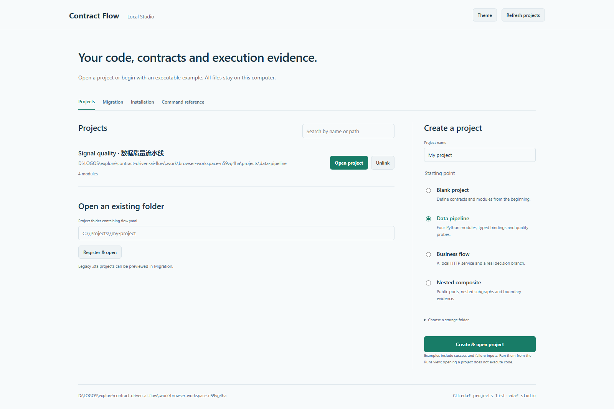

# Installable Web and CLI workbench

Scope: keep the reviewed contracts, explicit topology and isolated Python runtime. Make the installed application usable from an empty directory, retain project launch compatibility, and expose the same services through the UI and CLI. Publication and external CI are separate delivery gates.

| User task | Web entry | CLI entry | Acceptance |
| --- | --- | --- | --- |
| First launch, existing project, new project, three examples | Workspace | `studio`, `projects` | Isolated installed package, empty working directory, no Node/key |
| Validate and inspect execution structure | Architecture and tools | `check`, `plan`, `scan` | Same diagnostics/model; scanning never accepts inferred edges |
| Contracts, composites, connections, decision nodes | Canvas and versioned JSON editor | `propose`, `review` | Edits require review and retain concurrency checks |
| Run, history, pause/resume/cancel, replay | Runs | `run`, `runs` | Same run IDs, events, revision and controls |
| Probe creation, update, disable, removal, preview | Probes | `propose`, `probe` | Changes reviewed; strict preview result and errors |
| Context visibility and reviewed generation | Context | `context`, `generate` | L1–L4, fixture/provider/candidate, sanitized diff |
| Accept, reject, inverse rollback | Review | `review` | Same current revision checks and stored proposals |
| Offline and integration exports | Export and tools | `export` | HTML/SVG/PNG/Mermaid/JSON/OTLP/Archify parity |
| Migration with explicit resolutions | Workspace tools | `migrate` | Preview; separate destination; no source overwrite |
| Cache and completed-run retention | Tools | `clean` | Authored files preserved; scoped deletion is explicit |
| Installation diagnosis and shortcuts | Workspace tools | `doctor`, `shortcut` | Readable repair instructions and interpreter-bound launchers |
| Discover capabilities and equivalent commands | Tools reference | `capabilities`, `--help` | One shared command/feature catalogue |

Visual direction: extend the existing graphite/mint graph editor. Give the workspace a plain project list, a compact creation form, a three-template chooser, and visible recovery instructions. Keep the graph central; move maintenance and integration tasks into a separate tool panel. Use native inputs, consistent verbs, keyboard tab navigation, focus-managed dialogs, and responsive panels. No marketing claims or decorative status indicators.

Research consulted on 2026-10-01: [Streamlit](https://github.com/streamlit/streamlit) (~45.9k stars), [Langflow](https://github.com/langflow-ai/langflow) (~155.4k), [Node-RED](https://github.com/node-red/node-red) (~23.7k). Counts are rounded observations, not adoption or quality measurements. Streamlit's [CLI](https://docs.streamlit.io/develop/api-reference/cli) couples installation, launch, examples and diagnosis; Langflow's [installation guide](https://docs.langflow.org/get-started-installation) documents Python and desktop entry points; Node-RED's [palette documentation](https://nodered.org/docs/user-guide/runtime/adding-nodes) aligns editor and command operations. We adopt those entry and discoverability patterns without adding a marketplace or generic automation semantics.

[CLI Guidelines](https://clig.dev/) inform terminal versus JSON output, stderr errors, help, exit codes and stdin. [WAI-ARIA tabs](https://www.w3.org/WAI/ARIA/apg/patterns/tabs/) and [dialogs](https://www.w3.org/WAI/ARIA/apg/patterns/dialog-modal/) inform keyboard navigation, focus return and accessible naming. Capability descriptions come from source and are verified against executable paths; a matching label alone is not functional parity.

Validation: new workspace/service tests, project API parity tests, browser tasks from the workspace through review and execution, keyboard/responsive/error checks, then isolated wheel and source-install validation. Record actual results here as work is verified.

Local acceptance on Windows / Python 3.11.9: 351 Python tests passed and ten Edge/Playwright tasks passed. First-use browser acceptance creates a blank project, authors a module contract, reviews the architecture, generates and accepts a fixture implementation, and runs it. Further cases cover existing probes, plan/source/maintenance tools, mobile 390px layout, keyboard tabs, dialog focus return and missing-session recovery. An isolated wheel install passed all three executable examples, real background startup/reuse/shutdown, native shortcut creation and a fresh GUI-entry launch. An isolated `uv tool install` from the source archive passed CLI and workspace/example/shortcut checks. Source and asset digests are in [the validation receipt](assets/validation.json); external publication, macOS/Linux execution and live paid providers remain unverified.

The separately tested source archive has its own [installation receipt](assets/source-install.json). Its digest identifies that archived build; later documentation edits do not change the installed Python or bundled UI bytes.

